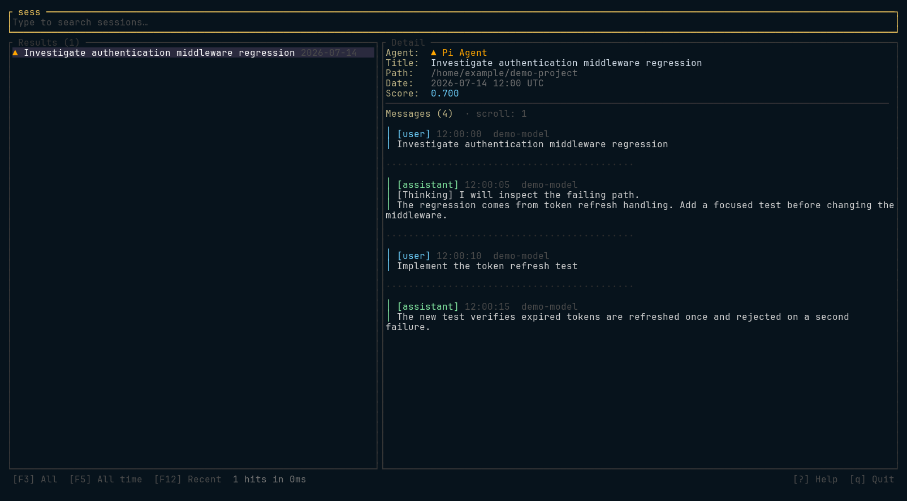

# sess

> Search coding-agent transcripts from one local index.

`sess` is a local-first Rust CLI and terminal UI for people who work across
Claude Code, Codex CLI, OpenCode, and Pi Agent sessions. It normalizes local
transcripts into SQLite, derives a Tantivy keyword index, and can add optional
FastEmbed-powered semantic ranking.

## Quickstart

Build the binary, create a local index without downloading the embedding model,
and run a JSON search:

```bash
cargo build --release
./target/release/sess --no-semantic index --full
./target/release/sess --no-auto-index search "auth middleware" --json --limit 20
```

The data directory defaults to your platform local-data directory plus `sess`
(for example, `~/.local/share/sess` on Linux). Pass `--data-dir <PATH>` to use
a different location.

## Usage

Run the built binary without a subcommand to open the interactive terminal UI.
It shows a query field, results, and the selected conversation's full message
stream.



Use the command help for the complete, generated interface:

```bash
./target/release/sess --help
```

### Common operations

```bash
./target/release/sess agents --json
./target/release/sess stats --json
```

`search` accepts agent, workspace, date, pagination, and ranking filters. Use
`--semantic` on a search to combine keyword results with embeddings when they
are available. `view` accepts either a conversation ID or its source path.

```bash
./target/release/sess search --help
./target/release/sess index --help
./target/release/sess stats --help
./target/release/sess agents --help
./target/release/sess view --help
```

### Index behavior

`sess search` and the TUI create an initial index when needed, then refresh a
stale index by default after 15 minutes. `--no-refresh` disables only the
age-based refresh; `--no-auto-index` disables both initial and stale refresh.
`--max-age` accepts values such as `5m`, `1h`, and `2h30m`.

Use `index --full` to rescan all supported transcript roots. Use `index
--rebuild` to derive Tantivy from the SQLite database without rescanning source
files, and `index --dry-run` to inspect a prospective incremental update
without writing.

### Supported sources

| Source | Default location | Override |
|---|---|---|
| Claude Code | `~/.claude/projects` | — |
| Codex CLI | `~/.codex/sessions`, `~/.codex/archived_sessions` | `CODEX_HOME` |
| OpenCode | `~/.local/share/opencode/storage` | `OPENCODE_STORAGE_ROOT` |
| Pi Agent and compatible layouts | `~/.pi/agent`, `~/.local/share/shiv`, `~/.openclaw` | `PI_CODING_AGENT_DIR`, `SHIV_AGENT_DIR`, `OPENCLAW_HOME` |

## Background refresh

For an unattended local index, optional integrations are provided for
[systemd user units](./contrib/systemd/README.md) and
[oxmgr](./contrib/oxmgr/README.md). The systemd service disables semantic
embeddings by default; the oxmgr loop enables them unless configured otherwise.

## Development

```bash
cargo test
```

See [CONTRIBUTING.md](./CONTRIBUTING.md) for contribution guidance and
[ARCHITECTURE.md](./ARCHITECTURE.md) for the storage, indexing, and connector
layout. The prioritized project direction is in [ROADMAP.md](./ROADMAP.md).

## Security

Session transcripts may contain sensitive prompts, source code, or secrets.
Treat the local SQLite database, Tantivy index, and optional embedding data as
sensitive. See [SECURITY.md](./SECURITY.md) for private vulnerability reporting.

## License

MIT — see [LICENSE](./LICENSE).
